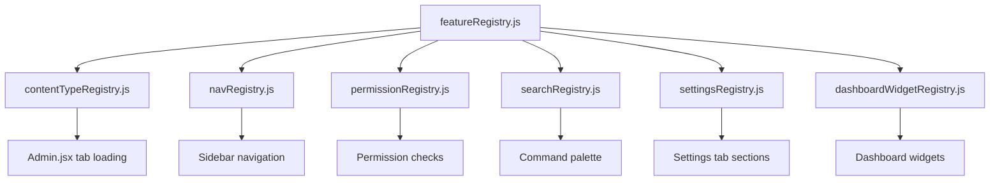

# Admin Registry Flow

```mermaid
flowchart TD
    Features["featureRegistry.js"] --> Content["contentTypeRegistry.js"]
    Features --> Nav["navRegistry.js"]
    Features --> Perms["permissionRegistry.js"]
    Features --> Search["searchRegistry.js"]
    Features --> Settings["settingsRegistry.js"]
    Features --> Widgets["dashboardWidgetRegistry.js"]
    Content --> Admin["Admin.jsx tab loading"]
    Nav --> Sidebar["Sidebar navigation"]
    Perms --> Access["Permission checks"]
    Search --> Palette["Command palette"]
    Settings --> SettingsTab["Settings tab sections"]
    Widgets --> Dashboard["Dashboard widgets"]
```

