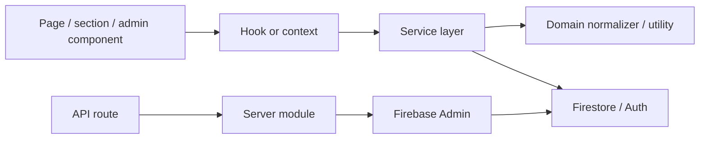

# Data Flow Diagram

```mermaid
flowchart LR
    Component["Page / section / admin component"] --> Hook["Hook or context"]
    Hook --> Service["Service layer"]
    Service --> Domain["Domain normalizer / utility"]
    Service --> Firebase["Firestore / Auth"]
    ApiRoute["API route"] --> ServerModule["Server module"]
    ServerModule --> FirebaseAdmin["Firebase Admin"]
    FirebaseAdmin --> Firebase
```

