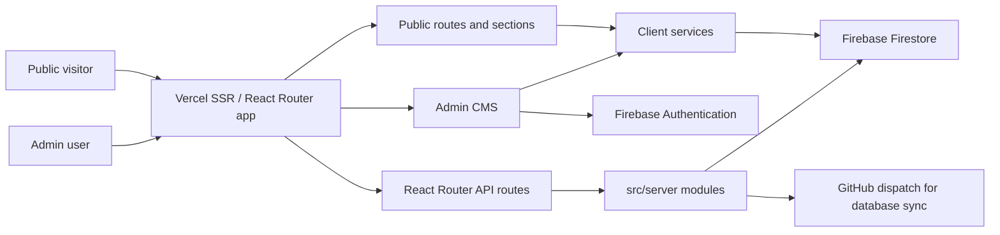

# Solution Context Diagram

```mermaid
flowchart LR
    Visitor["Public visitor"] --> Vercel["Vercel SSR / React Router app"]
    Admin["Admin user"] --> Vercel
    Vercel --> PublicRoutes["Public routes and sections"]
    Vercel --> AdminCMS["Admin CMS"]
    Vercel --> ApiRoutes["React Router API routes"]
    PublicRoutes --> Services["Client services"]
    AdminCMS --> Services
    Services --> Firestore["Firebase Firestore"]
    AdminCMS --> Auth["Firebase Authentication"]
    ApiRoutes --> Server["src/server modules"]
    Server --> Firestore
    Server --> GitHub["GitHub dispatch for database sync"]
```

